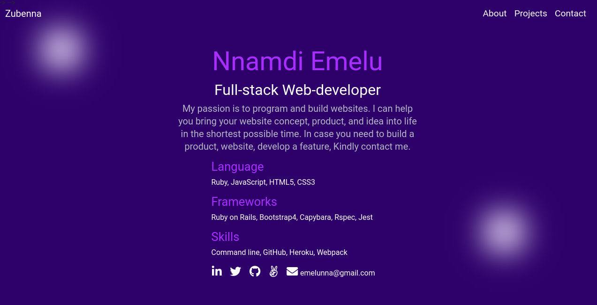
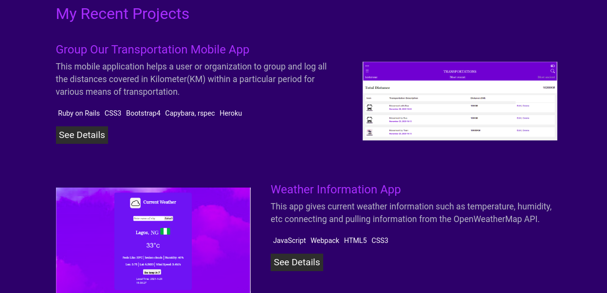
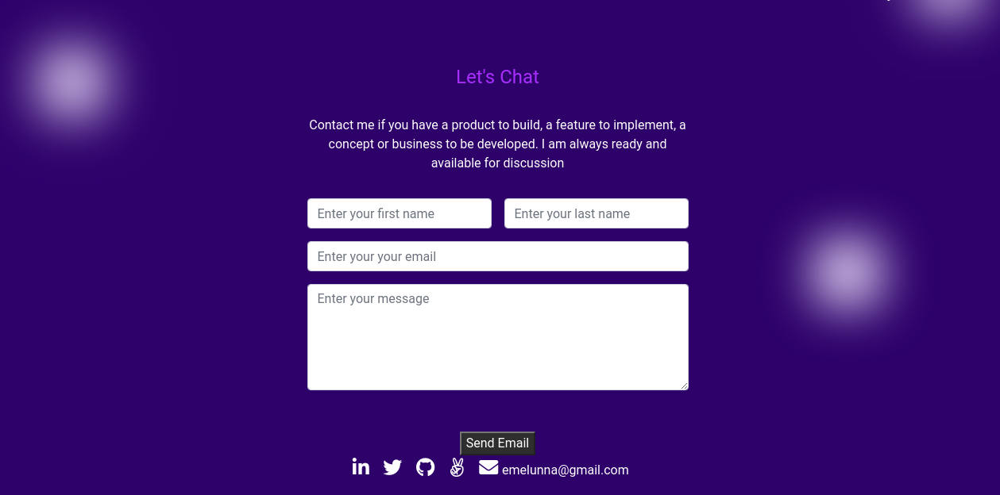
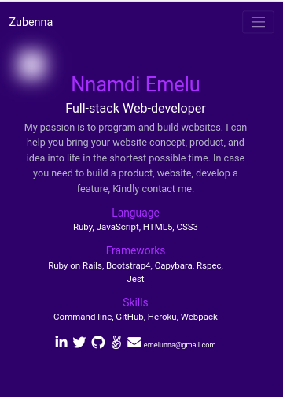
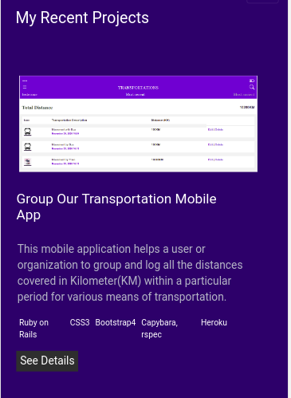
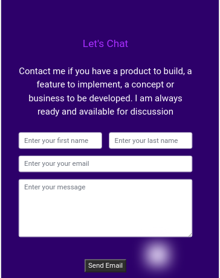

# My Personal Portfolio Webpage.
This is my portfolio webpage as a full-stack developer. This webpage gives all the basic but important professional information about me. They include My name, desired job role, links to my professional social media profiles, and a few of my recent projects. Scroll down to see my recent project section. When you clicked on the button 'See Details', more details about each of the project is displayed. Here you can see the live version of the code and the source code on my GitHub profile. Go through the project's README.md file to understand how to test and run the projects. This webpage is fully responsive.

## Preview

## Desktop view 1


## Desktop view 2


## Desktop view 3


## Mobile view 1


## Mobile view 2


## Mobile view 3


## Features 
- You can see my name, professional title, and skills.
- You can see a few of my recent projects.
- You can contact me through my professional social medial links.
- See more details about each project.
- Link to live version of the project.
- Link to project source code on Github.

## Project Setup (Local Setup)

Get a local copy of the file. Clone with HTTPS using the command below.

```
git clone https://github.com/Zubenna/my-fullstack-portfolio-index.html.git
```
## Access project folders 
```
cd my-fullstack-portfolio
```
- Click on index.html to display the application on the browser.
- Text all features.

## Live Version
Launch Live Version Below;
- [Launch App](https://compassionate-shannon-a3d7d8.netlify.app/)

## Built With
- HTML
- CSS
- Bootstrap 4

## Author

👤 **Nnamdi Emelu**
- Github: [@zubenna](https://github.com/zubenna)
- Twitter: [@zubenna](https://twitter.com/zubenna)
- Linkedin: [nnamdi-emelu](https://www.linkedin.com/in/nnamdi-emelu/)

##  Contributing

Contributions, issues, and feature requests are welcome!

Feel free to check the [issues page](https://github.com/Zubenna/my-fullstack-portfolio-index.html/issues)

## Show your support

Give a star if you like this project!

## Acknowledgments
- Project inspired by Microverse Program